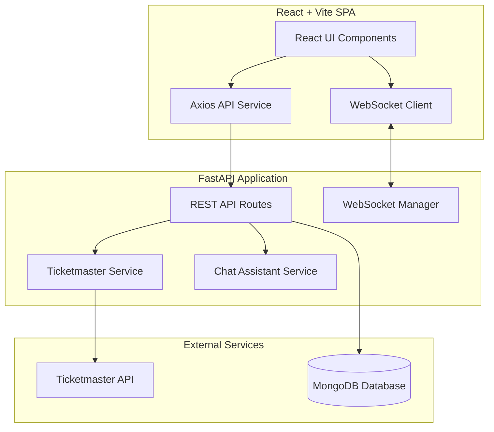

# EventVibe — Event Discovery & Tracking Platform

An intelligent, real-time Event Discovery and Tracking Platform built for the Quantiphi Technical Assessment.

---

## 1. Project Overview
EventVibe enables users to discover local and global events, RSVP to events, manage an RSVP dashboard, invite friends via trackable invite links, monitor attendance in real-time using WebSockets, and interact with a deterministic event search assistant.

---

## 2. Features
- **Event Feed & Discovery**: Ticketmaster Discovery API integration with fallback to structured mock events across Music, Technology, Sports, Arts, and Food.
- **Custom Event Calendar**: Interactive monthly calendar highlighting event dates and supporting date-based event filtering.
- **RSVP Management**: Single-click RSVP confirmation, duplicate RSVP prevention, and RSVP cancellation.
- **RSVP Dashboard**: Track total confirmed RSVPs and upcoming events (`date >= today`).
- **Friend Invitation System**: RSVP'd users can generate secure invitation links (`/invite/:token`).
- **Visitor Click Tracking vs. Attendance**: Deduplicated visitor click tracking (`clickCount`) distinct from confirmed friend attendance (`friendsAttending`).
- **Real-Time WebSocket Updates**: Live WebSocket broadcasts on RSVP actions to update affected event cards across clients without full page reloads.
- **User Profile & Reminders**: Profile management with configurable reminder lead times (1–10,080 minutes).
- **Intelligent Chat Assistant**: Keyword and regex-driven deterministic conversational assistant for querying events and personal RSVPs.

---

## 3. Architecture Overview
The platform follows a clean decoupled Client-Server architecture:
- **Frontend**: Single Page Application (SPA) built with React, Vite, React Router, and Axios.
- **Backend**: High-performance FastAPI application serving REST endpoints and managing WebSocket connections.
- **Database**: MongoDB with unique compound indexes for strict constraint enforcement.
- **External API**: Backend-only integration with Ticketmaster Discovery API.

---

## 4. Architecture Diagram



---

## 5. Technology Stack
- **Frontend**: React 18, Vite, React Router v6, Axios, Plain CSS (Dark Theme System)
- **Backend**: Python 3.14, FastAPI, Uvicorn, Pydantic v2, HTTPX, PyMongo / mongomock, WebSockets
- **Database**: MongoDB (with in-memory fallback for zero-dependency execution)

---

## 6. Folder Structure

```text
frontend/
├── src/
│   ├── components/
│   │   ├── Navbar.jsx
│   │   ├── EventCard.jsx
│   │   ├── EventCalendar.jsx
│   │   ├── RSVPCard.jsx
│   │   ├── Chat.jsx
│   │   └── Loading.jsx
│   ├── pages/
│   │   ├── Home.jsx
│   │   ├── Dashboard.jsx
│   │   ├── Profile.jsx
│   │   └── Invite.jsx
│   ├── services/
│   │   └── api.js
│   ├── App.jsx
│   ├── main.jsx
│   └── index.css
├── package.json
└── vite.config.js

backend/
├── main.py
├── database.py
├── schemas.py
├── websocket_manager.py
├── smoke_test.py
├── requirements.txt
├── .env.example
├── routes/
│   ├── events.py
│   ├── rsvps.py
│   ├── invites.py
│   ├── users.py
│   └── chat.py
└── services/
    ├── ticketmaster.py
    ├── event_service.py
    └── chat_service.py

README.md
.gitignore
```

---

## 7. MongoDB Collections

### `users`
- `_id`: ObjectId / String
- `name`: String
- `email`: String (Unique)
- `reminderSettings`: `{ enabled: bool, beforeMinutes: int }`
- `createdAt`: Datetime

### `rsvps`
- `_id`: ObjectId / String
- `userId`: String
- `eventId`: String
- `eventSnapshot`: `{ title, venue, city, date, time, image, category }`
- `status`: `"confirmed"`
- `inviteToken`: Optional String
- `createdAt`: Datetime

### `invites`
- `_id`: ObjectId / String
- `token`: String (Unique)
- `eventId`: String
- `eventSnapshot`: Dict
- `creatorUserId`: String
- `clickCount`: Integer
- `friendsAttending`: Integer
- `createdAt`: Datetime

### `invite_clicks`
- `_id`: ObjectId / String
- `token`: String
- `visitorId`: String
- `clickedAt`: Datetime

---

## 8. Database Indexes
- `users`: `(email)` [Unique]
- `rsvps`: `(userId, eventId)` [Unique Compound Index]
- `invites`: `(token)` [Unique], `(creatorUserId, eventId)` [Unique Compound Index]
- `invite_clicks`: `(token, visitorId)` [Unique Compound Index]

---

## 9. API Endpoints

| Method | Endpoint | Description |
|---|---|---|
| `GET` | `/api/health` | Service health status |
| `GET` | `/api/events` | Event feed (Ticketmaster + Mock) |
| `POST` | `/api/rsvps` | Create RSVP |
| `GET` | `/api/rsvps/{user_id}` | Fetch user RSVPs & statistics |
| `DELETE` | `/api/rsvps/{user_id}/{event_id}` | Cancel RSVP & decrement invite attendance |
| `POST` | `/api/invites/{event_id}` | Create or return friend invite link |
| `GET` | `/api/invites/{token}` | Fetch invite details |
| `POST` | `/api/invites/{token}/click` | Track visitor click (deduplicated) |
| `POST` | `/api/invites/{token}/rsvp` | Friend RSVP via invite link |
| `GET` | `/api/users` | List seed demo users |
| `GET` | `/api/users/{user_id}` | Fetch user profile |
| `PUT` | `/api/users/{user_id}/reminders` | Update reminder preferences |
| `POST` | `/api/chat` | Process assistant query |
| `WS` | `/ws` | Real-time WebSocket connection |

---

## 10. Environment Variables

Create `backend/.env`:
```text
MONGODB_URI=mongodb://localhost:27017
TICKETMASTER_API_KEY=
CLIENT_URL=http://localhost:5173
PORT=8000
```

Frontend environment variable (optional, defaults to `http://localhost:8000`):
```text
VITE_API_URL=http://localhost:8000
```

---

## 11. Local Setup Instructions

### Prerequisites
- Python 3.10+
- Node.js 18+ and npm

### Backend Setup
1. Navigate to `backend/`:
   ```bash
   cd backend
   ```
2. Install Python dependencies:
   ```bash
   pip install -r requirements.txt
   ```
3. Copy `.env.example` to `.env`:
   ```bash
   cp .env.example .env
   ```

### Frontend Setup
1. Navigate to `frontend/`:
   ```bash
   cd frontend
   ```
2. Install npm packages:
   ```bash
   npm install
   ```

---

## 12. Backend Startup Command
```bash
cd backend
python -m uvicorn main:app --host 0.0.0.0 --port 8000 --reload
```

---

## 13. Frontend Startup Command
```bash
cd frontend
npm run dev
```

---

## 14. Demo Users
On startup, the system seeds 3 demo users if the database is empty:
1. **Demo User** (`demo@example.com`)
2. **Friend User** (`friend@example.com`)
3. **Friend Two** (`friend2@example.com`)

The Navbar includes a User Switcher dropdown to seamlessly switch between users for testing invite and RSVP interactions.

---

## 15. RSVP Flow
1. User clicks **Interested** on an event card.
2. Request sent to `POST /api/rsvps`.
3. Backend validates user, event payload, and inserts RSVP.
4. If `(userId, eventId)` already exists, MongoDB throws `DuplicateKeyError`, returning `409 Conflict`.
5. On success, event snapshot is saved, and UI updates button state to **Interested ✓** with a **Share** button.

---

## 16. Friend Invite Flow
1. RSVP'd user clicks **Share**.
2. Request sent to `POST /api/invites/{event_id}`.
3. Backend verifies user is RSVP'd, generates a secure token, stores `eventSnapshot`, and returns the link.
4. Friend opens link `/invite/:token`.
5. Page calls `POST /api/invites/{token}/click` to register a unique visitor click.
6. Friend clicks **I'm Interested (RSVP)**, triggering `POST /api/invites/{token}/rsvp`.
7. Backend inserts RSVP with `inviteToken`, increments `friendsAttending` by 1, and broadcasts a WebSocket update.

---

## 17. Click Tracking vs. Friends Attending
- **`clickCount`**: Tracks total unique visitors who clicked the invite link (`invite_clicks` compound unique index on `(token, visitorId)`). Creator clicks are excluded.
- **`friendsAttending`**: Tracks actual confirmed RSVPs created via the invite token. Creator RSVPs and duplicate RSVPs do NOT increment `friendsAttending`.

$$\text{clickCount} \neq \text{friendsAttending}$$

---

## 18. WebSocket Architecture
- Endpoint: `/ws`
- Managed via `websocket_manager.py`.
- Whenever an RSVP is confirmed or cancelled via an invite, the backend broadcasts:
  ```json
  {
      "type": "rsvp_updated",
      "eventId": "mock-1",
      "creatorUserId": "...",
      "friendsAttending": 3,
      "clickCount": 5
  }
  ```
- React clients listen to WebSocket messages and update affected event card states dynamically.

---

## 19. Chat Implementation
- Service: `backend/services/chat_service.py`.
- Deterministic keyword and regex intent parsing.
- Supports intent matching for event categories (Music, Technology, Sports, Arts, Food), cities (Mumbai, Pune, New York, Bangalore), dates (today, tomorrow, this week), and user attendance queries ("what events am I attending?").

---

## 20. Key Design Decisions
1. **Server-Side Authority**: All attendance counts, stats, upcoming checks, and authorization rules are computed exclusively on the backend.
2. **Event Snapshots**: Event metadata (title, venue, city, date, image) is snapshotted into RSVP and Invite documents so user dashboards remain readable even if external API data changes.

---

## 21. Simplified Authentication Explanation
> This is simplified assessment authentication. A production implementation would use proper authentication such as JWT/OAuth with password hashing and session tokens.

---

## 22. Unique-Index Deduplication Explanation
Instead of relying on fragile "check if exists, then insert" application code, deduplication relies on MongoDB database unique indexes (`DuplicateKeyError`), guaranteeing atomic uniqueness even under concurrent requests.

---

## 23. Event Snapshot Explanation
Ticketmaster event IDs or external API structures can change over time. Storing an immutable `eventSnapshot` at the moment of RSVP guarantees that the user's dashboard displays consistent event information.

---

## 24. Why PyMongo is Synchronous
PyMongo is used synchronously inside FastAPI route handlers for simplicity and reliability during this MVP assessment. PyMongo's synchronous calls execute swiftly for local/in-memory database operations. In production, `motor` (async MongoDB driver) or threadpools can be introduced.

---

## 25. Known Limitations
- Authentication uses a simple dropdown user switcher.
- Chat assistant uses deterministic regex/keyword parsing rather than LLMs.

---

## 26. Future Improvements
- Integrate JWT/OAuth2 authentication.
- Upgrade to Motor for fully asynchronous MongoDB driver calls.
- Add email/SMS notifications for event reminders.
- Add location-based geolocation search for events.